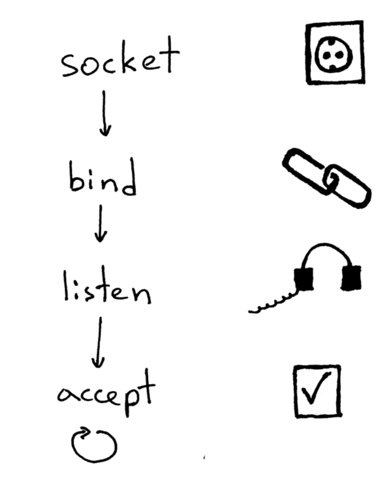
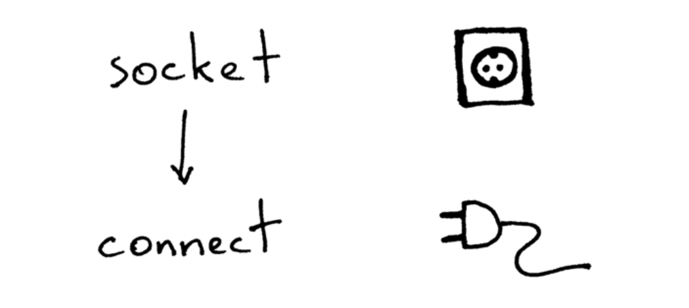
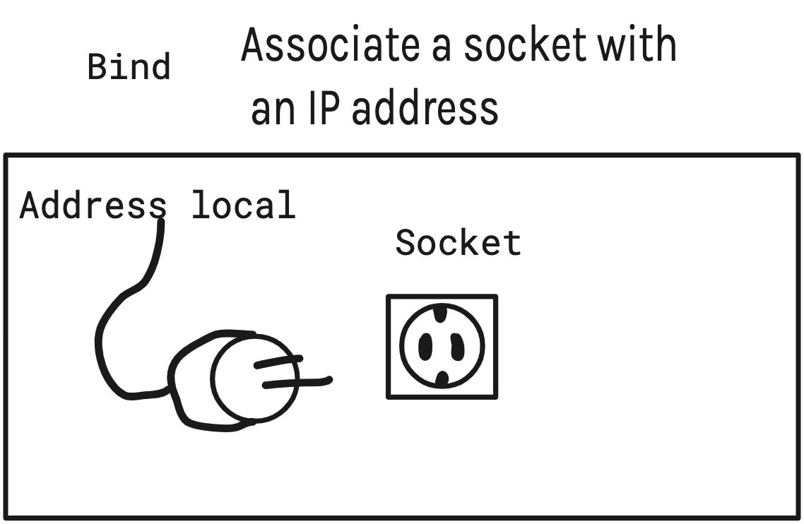
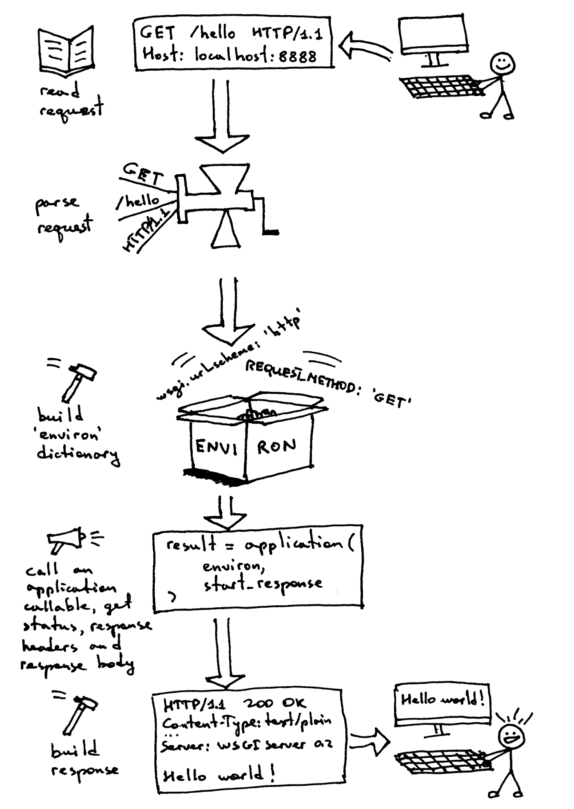
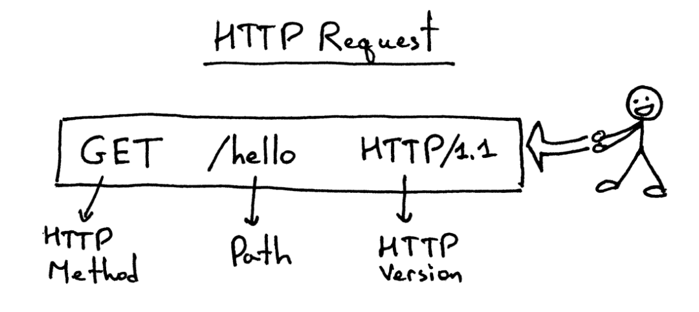
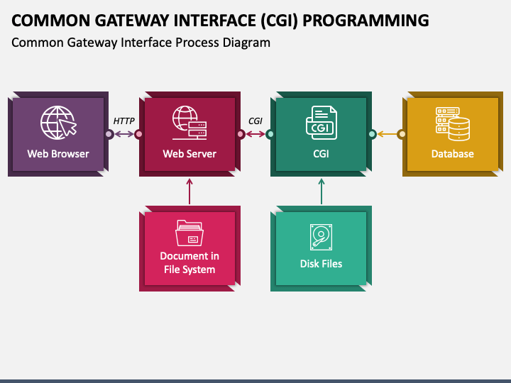
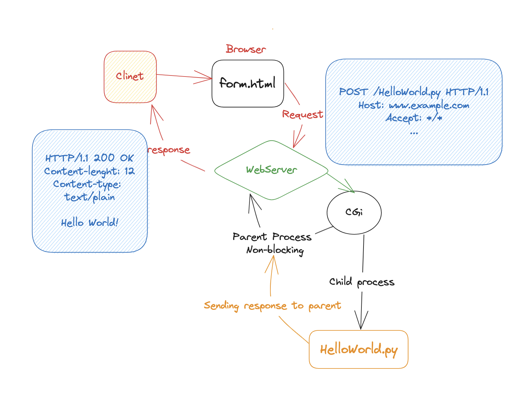

# WebServ_42

Using Object-Oriented Programming and the Finite State Machine design pattern, an with the power of SOLID Principles, I embarked on a C++ journey with Webserv. In collaboration with my team, we crafted a high-performance web server that boasts several key features. These include a configuration file with its unique syntax, drawing inspiration from Nginx, non-blocking behavior achieved through I/O Multiplexing, support for multiple ports, precise HTTP response handling, and a range of captivating functionalities such as uploading files with large sizes to the server, cookie management, sessions, and CGI support (with compatibility for Python and Perl). It is a web server that is compliant with the HTTP Protocol, and conditionally compliant with the RFC manual. My journey stands as a testament to my unwavering commitment to excellence and innovation, demonstrating my ability to harness the power of C++ to create a remarkable digital asset.

### Socket-Bind-listing-connection

### Socket:
Sockets allow communication between two different processes on the same or different machines.

### Bind

bind is a system call that associates a socket with a local address and port number. This allows the socket to receive connections from other computers on the network.

### listen
is used to listen for incoming connections on a socket. The listen() function takes two arguments: the first argument is the socket file descriptor, and the second argument is the backlog queue size.
The backlog queue size is the maximum number of connections that can be queued before the system starts refusing connections.

### accept

is used to accept an incoming connection on a socket. The accept() function takes two arguments: the first argument is the socket file descriptor, and the second argument is a pointer to a sockaddr structure, which will be filled in with the address of the client that connected.

---
## HTTP 

HTTP stands for HyperText Transfer Protocol. It is a set of rules for exchanging data between a client and a server. HTTP is the foundation of the World Wide Web, and it is used to transfer all kinds of data, including HTML pages, images, videos, and files.
Here explain all of the previews :

#### Request:

##### RequestLine :

****
## CGI :
- **CGI** : (Common Gateway Interface) is used to provide a dynamic content to the user. It is a standard way for web servers to interact with external programs. CGI programs are typically written in scripting languages such as Perl, Python, or PHP.

When a user requests a page that contains a CGI script, the web server will execute the script and return the results to the user. This allows web servers to generate dynamic content, such as personalized web pages or interactive forms.

Here explain more about CGI how it's Work

****

### Resouces

* https://beej.us/guide/bgnet/html/split/system-calls-or-bust.html
* https://web.archive.org/web/20100127161358/http://hoohoo.ncsa.illinois.edu/cgi/
* https://www.rfc-editor.org/rfc/rfc6265
* https://www.youtube.com/playlist?list=PLZIwlOSv75K7jXcVABdIo3wyKp5NwXKlW
* https://www.youtube.com/watch?v=wB9tIg209-8
